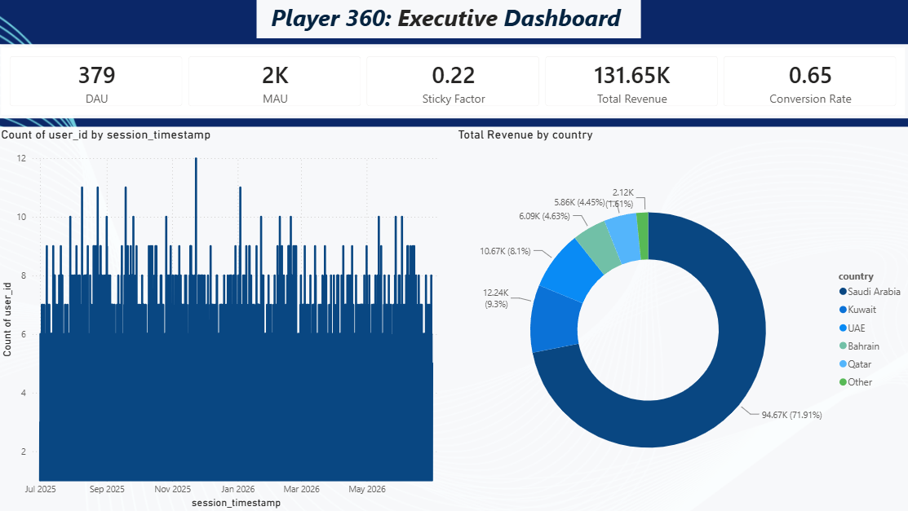
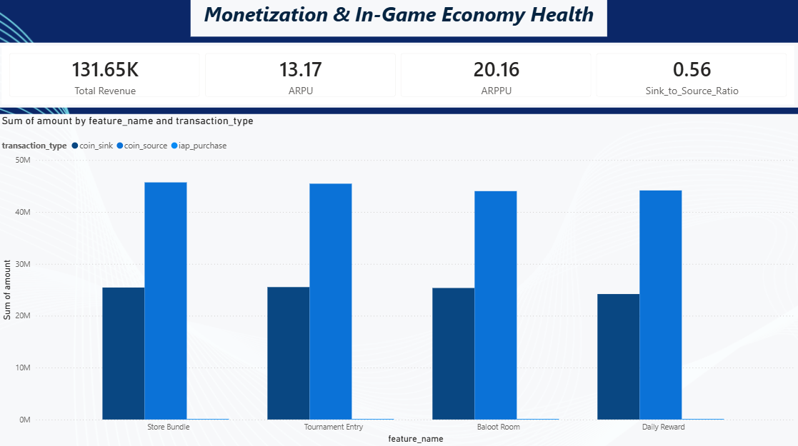
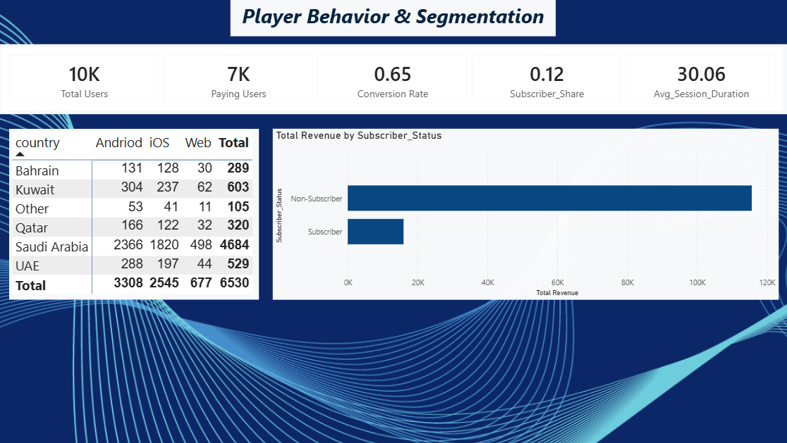

# Player360 — Gaming Analytics & Monetization Command Center

Concise synthetic data generator and notebook for gaming analytics experiments.

## Overview

This project produces synthetic gaming datasets that simulate a simple star-schema: player dimension plus session and economy facts. The outputs (CSV) are suitable for practicing ETL, analytics, SQL, and dashboarding workflows.

Key datasets generated:

- `dim_users` — player profiles and demographics
- `fact_sessions` — gameplay sessions and metrics
- `fact_economy` — in-game transactions and monetization events

## Repository structure

- `dashboard/` — Power BI Dashboard of the generated data of this project
- `data/` — generated CSV outputs
- `notebook/` — Jupyter notebook used to generate data 
- `requirements.txt` — requirements file should be installed to run the code

## Getting started

Prerequisites

- Python 3.10+ (or compatible 3.x)
- Recommended: create a virtual environment

Quick setup (PowerShell example):

```powershell
python -m venv .venv
.\.venv\Scripts\Activate.ps1
pip install -r requirements.txt  
```

## Running the notebook

1. Open `notebook/data_generator.ipynb` in VS Code or Jupyter Lab/Notebook.
2. Run the cells sequentially. The notebook generates CSV files in `data/`.

Tip: use the VS Code Jupyter experience or run `jupyter lab` from the project root.

## Data files

After a successful run the `data/` folder should contain:

- `dim_users.csv` — player information
- `fact_sessions.csv` — session events and metrics
- `fact_economy.csv` — economy/transaction events

The generated datasets are deterministic when the notebook's random seed is fixed (see cell that sets the seed in the notebook).

## Dashboard Preview

### 1. Executive Summary
High-level overview tracking DAU, MAU, Sticky Factor, Total Revenue, and conversion performance.



### 2. Monetization & In-Game Economy Health
Breakdown of ARPU, ARPPU, transaction flows, and coin sinks vs. sources across game features.



### 3. Player Behavior & Segmentation
Regional breakdown, device platform distribution (Android, iOS, Web), and VIP subscriber revenue comparisons.

